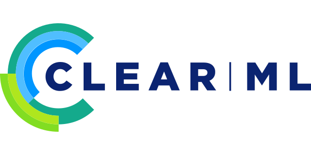

Hi everyone 
My name is Kirill
=============================================================================================================================

I'm Data Scientist📊, focusing in Deep Learning🐈🐕 and Computer Vision👀
--------------

</a>

I am passionate about programming and always excited to solve algorithm problems.\
I thoroughly enjoy going deep into research to find effective solutions for real-world problems.\
The challenges of coding and the ability to make a real impact drive me to constantly expand my knowledge and skills.

### Socials

### Skills
* Programming Languages: 
,

* ML:
,
,
,
,
,
,
etc. 

* DL: 
,
,
etc.

* DS Tools: 
, 
, 
, 
etc.

* Software Skills: 
, 
, 
etc.

<h2 align="left"><strong>Education / Pet Projects / Courses/ Competitions </h3>

#### Education
* **[Sber University, IT-School](https://github.com/kirill-ionkin/Ionkin-ds-school)**  
  Data Science, Jan. 2021 - June 2021

* **Moscow Institute of Physics and Technology**  
  Department of Aeromechanics and Flight Engineering(completed 3 courses), 2016 - 2020 

#### Pet Projects
* [Задача классификации открытых/закрытых глаз](https://github.com/kirill-ionkin/Test_tasks/tree/main/VisionLabs) @ VisionLabs(test task)
* [News classification](https://github.com/kirill-ionkin/OpenDataBattle/tree/main/News) @ Open Data Battle
* [Neural Style Transfer](https://github.com/kirill-ionkin/NST_Gatys) @ Sber University, IT-School

#### Courses
* [Deep Learning School(NLP)](https://github.com/kirill-ionkin/Deep_Learning_School_part_2) @ MIPT (Sep. 2021 - current)
* [Deep Learning School(Computer Vision)](https://github.com/kirill-ionkin/Deep_Learning_School_part_1) @ MIPT (Sep. 2020 - March 2021)
* [MLCourse.ai](https://ods.ai/projects/mlcourse) @  OpenDataScience
* [Machine Learning and Data Analysis](https://www.coursera.org/specializations/machine-learning-data-analysis) @ MIPT & Yandex on Coursera ([1](https://www.coursera.org/account/accomplishments/verify/JJEWLND5TB53), 2, 3, 4, 5, 6)
* [Основы статистики. Часть 2](https://stepik.org/cert/790734) @ Stepik (Oct. 2020)
* [Основы статистики. Часть 1](https://stepik.org/cert/580082) @ Stepik (Aug. 2020)

* [Python Programming](https://www.coursera.org/specializations/programming-in-python) @ MIPT & Mail.ru on Coursera ([1](https://www.coursera.org/account/accomplishments/verify/ECWHUDS867SY), [2](https://www.coursera.org/account/accomplishments/verify/7TSG5GLTDR7G), 3, 4, 5)
* [Интерактивый тренажёр по SQL](https://stepik.org/course/63054/info) @ Stepik ([1](https://stepik.org/cert/1036234))

#### Hackathons
* [Open Data  Battle.](https://github.com/kirill-ionkin/OpenDataBattle/tree/main/finall_1_task) Хакатон от банка "Открытие", 39 место(~ top 15%)

