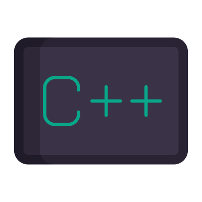
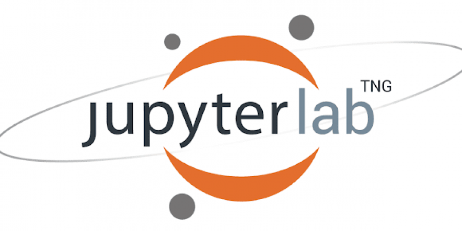

Hi everyone 
My name is Kirill
=============================================================================================================================

I'm Data Scientist📊, focusing in Deep Learning🐈🐕 and Computer Vision👀
--------------

</a>

I am passionate about programming and always excited to solve algorithm problems.\
I thoroughly enjoy going deep into research to find effective solutions for real-world problems.\
The challenges of coding and the ability to make a real impact drive me to constantly expand my knowledge and skills.

### Socials

### Skills
* Programming Languages: 
,

* ML:
,
,
,
,
,
,
etc. 

* DL: 
,
,
etc.

* DS Tools: 
, 
, 
, 
etc.

* Software Skills: 
, 
, 
etc.

* 

###### TODO:
structured README for other branches: README_old_version.md

<h3 align="left"><strong>Completed Projects (can be shared upon request):</strong></h3>

