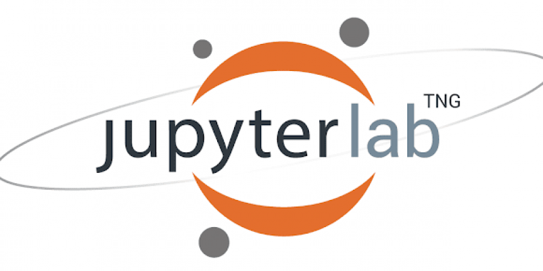

# 
[Best VSCode extensions in 2023](https://www.youtube.com/watch?v=DNf6Bu7z4vw&list=PLGIi8ycpv5RD0s1pe9B10lL7K7UkD3KAG&index=3&t=4s)

#
- [Python](https://marketplace.visualstudio.com/items?itemName=ms-python.python)
- [Pylance](https://marketplace.visualstudio.com/items?itemName=ms-python.vscode-pylance)
- [autoDocstring - Python Docstring Generator](https://marketplace.visualstudio.com/items?itemName=njpwerner.autodocstring)

#
- [Jupyter](https://marketplace.visualstudio.com/items?itemName=ms-toolsai.jupyter )
- [Jupyter Cell Tags](https://marketplace.visualstudio.com/items?itemName=ms-toolsai.vscode-jupyter-cell-tags)
- [Jupyter Keymap](https://marketplace.visualstudio.com/items?itemName=ms-toolsai.jupyter-keymap)
- [Jupyter Slide Show](https://marketplace.visualstudio.com/items?itemName=ms-toolsai.vscode-jupyter-slideshow)

# 
- [C/C++](https://marketplace.visualstudio.com/items?itemName=ms-vscode.cpptools)
- [C/C++ Extension Pack](https://marketplace.visualstudio.com/items?itemName=ms-vscode.cpptools-extension-pack)
- [C/C++ Themes](https://marketplace.visualstudio.com/items?itemName=ms-vscode.cpptools-themes)
- [CMake](https://marketplace.visualstudio.com/items?itemName=twxs.cmake)
- [CMake Tools](https://marketplace.visualstudio.com/items?itemName=ms-vscode.cmake-tools)

# 
- [Git Blame](https://marketplace.visualstudio.com/items?itemName=waderyan.gitblame)
- [Git Graph](https://marketplace.visualstudio.com/items?itemName=mhutchie.git-graph)
- [Git History](https://marketplace.visualstudio.com/items?itemName=donjayamanne.githistory)
- [GitLens — Git supercharged](https://marketplace.visualstudio.com/items?itemName=eamodio.gitlens)
- [GitLab Workflow](https://marketplace.visualstudio.com/items?itemName=GitLab.gitlab-workflow)

#
- [Docker](https://marketplace.visualstudio.com/items?itemName=ms-azuretools.vscode-docker)
- [WSL](https://marketplace.visualstudio.com/items?itemName=ms-vscode-remote.remote-wsl)
- [Dev Containers](https://marketplace.visualstudio.com/items?itemName=ms-vscode-remote.remote-containers)
- [Remote - SSH](https://marketplace.visualstudio.com/items?itemName=ms-vscode-remote.remote-ssh)
- [Remote - SSH: Editing Configuration Files](https://marketplace.visualstudio.com/items?itemName=ms-vscode-remote.remote-ssh-edit)
- [Remote - Tunnels](https://marketplace.visualstudio.com/items?itemName=ms-vscode.remote-server)
- [Remote Development](https://marketplace.visualstudio.com/items?itemName=ms-vscode-remote.vscode-remote-extensionpack)
- [Remote Explorer](https://marketplace.visualstudio.com/items?itemName=ms-vscode.remote-explorer)

# 

- [Auto-Open Markdown Preview](https://marketplace.visualstudio.com/items?itemName=hnw.vscode-auto-open-markdown-preview)
- [Better Comments](https://marketplace.visualstudio.com/items?itemName=aaron-bond.better-comments)
- [Import Cost](https://marketplace.visualstudio.com/items?itemName=wix.vscode-import-cost)
- [indent-rainbow](https://marketplace.visualstudio.com/items?itemName=oderwat.indent-rainbow)
- [Output Colorizer](https://marketplace.visualstudio.com/items?itemName=IBM.output-colorizer)
- [TODO Highlight](https://marketplace.visualstudio.com/items?itemName=wayou.vscode-todo-highlight)
- [Todo Tree](https://marketplace.visualstudio.com/items?itemName=Gruntfuggly.todo-tree)

#
- [AWS Toolkit - Amazon Q, CodeWhisperer, and more](https://marketplace.visualstudio.com/items?itemName=AmazonWebServices.aws-toolkit-vscode)

# 

 [Migrate from classical Jupyter notebook](https://jupyterlab-contrib.github.io/migrate_from_classical.html)
- [ipywidgets](https://github.com/jupyter-widgets/ipywidgets)
- [jupyterlab-execute-time](https://github.com/deshaw/jupyterlab-execute-time)
- [jupyterlab_pygments](https://github.com/jupyterlab/jupyterlab_pygments)
- [jupyterlab_code_formatter](https://github.com/ryantam626/jupyterlab_code_formatter)
- [jupyterlab-lsp](https://github.com/jupyter-lsp/jupyterlab-lsp)
- [jupyter-ai](https://github.com/jupyterlab/jupyter-ai)
- [
jupyterlab-contrib-spellchecker](https://github.com/jupyterlab-contrib/spellchecker)

# 